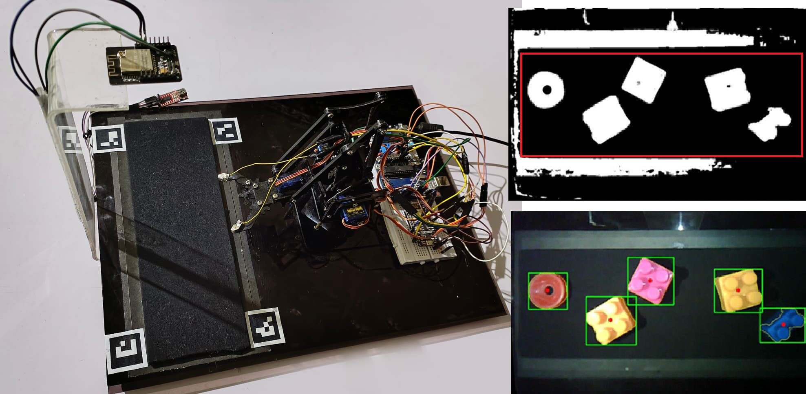
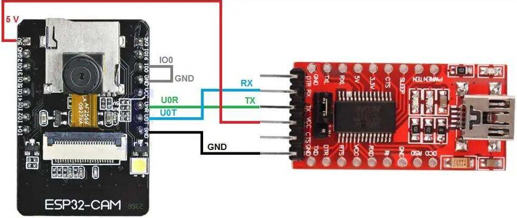
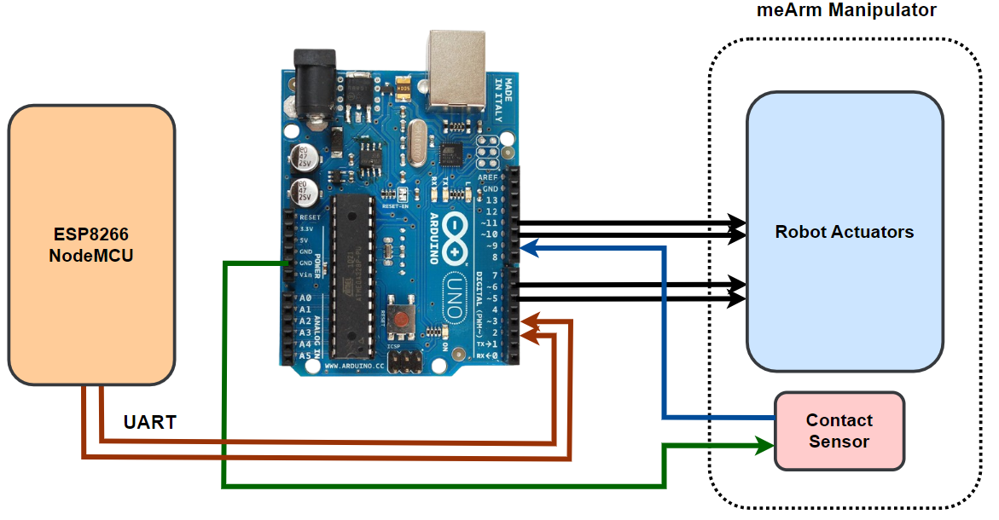
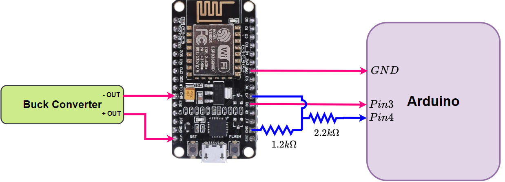
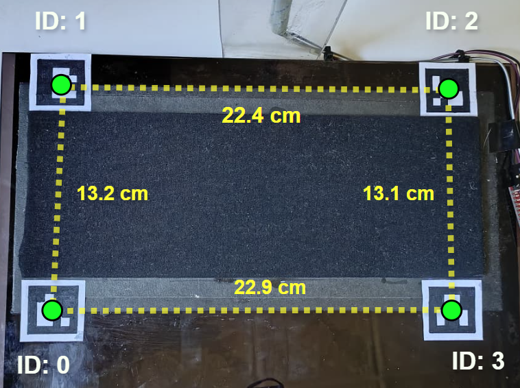
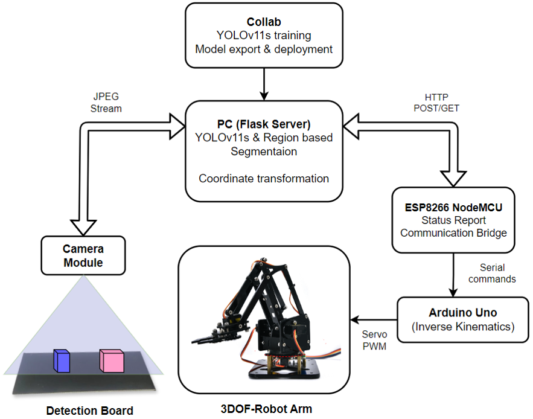

# Deep-Learning-Based-Image-Processing-for-Autonomous-Pick-and-Place-Systems
Autonomous robotic manipulator powered by Python Flask, Arduino, and Computer Vision. Solves monocular projection errors using ArUco-based homography and parallax correction. Includes real-time object detection for both known classes and unfamiliar items in unpredictable positions.


# Vision-Guided Robotic Sorting System

<p align="center">
  
</p>

> Low-cost autonomous pick-and-place using YOLOv11 + Adaptive Segmentation for educational and small-scale applications

[](https://www.python.org/downloads/)
[](https://opensource.org/licenses/MIT)

## Table of Contents

- [Overview](#overview)
- [Features](#features)
- [Hardware Requirements](#hardware-requirements)
- [Software Requirements](#software-requirements)
- [Installation](#installation)
  - [1. Python Environment Setup](#1-python-environment-setup)
  - [2. ESP32-CAM Setup](#2-esp32-cam-setup)
  - [3. Arduino Uno Setup](#3-arduino-uno-setup)
  - [4. ESP8266 NodeMCU Setup](#4-esp8266-nodemcu-setup)
- [Hardware Assembly](#hardware-assembly)
- [Calibration](#calibration)
- [Usage](#usage)
- [System Architecture](#system-architecture)
- [Troubleshooting](#troubleshooting)
- [Performance](#performance)
- [Contributing](#contributing)
- [License](#license)
- [Citation](#citation)

---

## Overview

This project implements a complete vision-guided robotic sorting system that addresses three fundamental challenges:
1. **Incomplete detection coverage** - Hybrid YOLOv11 + Adaptive Segmentation
2. **Monocular projection errors** - Geometric parallax correction
3. **Low-DOF kinematic constraints** - Analytical inverse kinematics with contact verification
The system achieves:
- **0.995 mAP@0.5** for trained object detection
- **94.3%** reliability for unknown object segmentation
- **0.28 cm** mean positioning error
- **15-20 FPS** real-time processing on laptop CPU

---

## Features

-  **Hybrid Object Detection**: YOLOv11 for known objects + adaptive thresholding for unknowns
-  **Monocular Localization**: ArUco-based calibration with parallax correction
-  **Closed-Loop Control**: Contact sensor verification with error recovery
-  **Distributed Architecture**: WiFi-based communication between vision server and robot
-  **Low-Cost Hardware**: Consumer-grade camera and hobby servos (~$150 total)

---

## Hardware Requirements

### Core Components

| Component | Specification | Quantity | Approx. Cost |
|-----------|--------------|----------|--------------|
| ESP32-CAM | OV2640 sensor, WiFi | 1 | $10 |
| Arduino Uno R3 | ATmega328P, 16 MHz | 1 | $25 |
| ESP8266 NodeMCU | WiFi module | 1 | $8 |
| meArm Robot | 3-DOF desktop arm | 1 | $40 |
| SG90 Servo Motors | 4.8-6V, 1.8kg-cm | 4 | $8 |
| FTDI USB-Serial Adapter | 3.3V/5V | 1 | $5 |
| Buck Converter | 12V → 5V, 3A | 1 | $3 |
| Contact Sensor | Mechanical switch | 1 | DIY |
| ArUco Markers | DICT_4X4_250 | 4 | Print |
| Power Supply | 12V DC | 1 | $10 |

### Additional Materials
- Jumper wires (M-M, M-F)
- Breadboard
- USB cables (Type-A to Micro-B, Type-A to Type-B)
- Rigid workspace board (~30cm × 20cm)
- Matte non-reflective surface material

**Total Hardware Cost**: ~$150 USD

---

## Software Requirements

- **Operating System**: Windows 10/11, Linux, or macOS
- **Python**: 3.8 or higher
- **Arduino IDE**: 1.8.19 or higher
- **Web Browser**: Chrome, Firefox, or Edge (for viewing video stream)

---

## Installation

### 1. Python Environment Setup

#### Clone Repository
```bash
git clone https://github.com/YOUR_USERNAME/vision-guided-sorting.git
cd vision-guided-sorting
```

#### Create Virtual Environment (Recommended)
```bash
# Windows
python -m venv venv
venv\Scripts\activate

# Linux/Mac
python3 -m venv venv
source venv/bin/activate
```

#### Install Python Dependencies
```bash
pip install -r requirements.txt
```

**requirements.txt contents:**
```txt
flask==3.0.0
opencv-python==4.8.1.78
opencv-contrib-python==4.8.1.78
numpy==1.24.3
ultralytics==8.1.0
requests==2.31.0
Pillow==10.1.0
```

#### Verify Installation
```bash
python -c "import cv2; print(cv2.__version__)"
python -c "from ultralytics import YOLO; print('YOLO OK')"
```

---

### 2. ESP32-CAM Setup

<p align="center">
  
</p>

#### Hardware Connections (Programming Mode)

**FTDI Adapter → ESP32-CAM:**
```
FTDI GND    →  ESP32-CAM GND
FTDI 5V     →  ESP32-CAM 5V
FTDI TX     →  ESP32-CAM U0RXD
FTDI RX     →  ESP32-CAM U0TXD
ESP32 GPIO0 →  GND (for upload mode)
```

⚠️ **Important**: Ground GPIO0 ONLY during upload. Disconnect after uploading.

#### Software Upload

1. **Open Arduino IDE**
2. **Install ESP32 Board Support**:
   - Go to `File → Preferences`
   - Add to "Additional Board Manager URLs":
```
     https://raw.githubusercontent.com/espressif/arduino-esp32/gh-pages/package_esp32_index.json
```
   - Go to `Tools → Board → Boards Manager`
   - Search "ESP32" and install "esp32 by Espressif Systems"

3. **Configure Board Settings**:
```
   Board: "AI Thinker ESP32-CAM"
   Upload Speed: "115200"
   Flash Frequency: "80MHz"
   Flash Mode: "QIO"
   Partition Scheme: "Huge APP (3MB No OTA/1MB SPIFFS)"
   Port: Select your FTDI adapter port
```

4. **Update WiFi Credentials** in `esp_cam/espcam_MJPEG.ino`:
```cpp
   const char* ssid = "YOUR_WIFI_SSID";
   const char* password = "YOUR_WIFI_PASSWORD";
   const char* serverIP = "YOUR_LAPTOP_IP";  // e.g., "192.168.1.100"
```

5. **Upload Code**:
   - Connect GPIO0 to GND
   - Click Upload button
   - Wait for "Leaving..." message
   - **Disconnect GPIO0 from GND**
   - Press RESET button on ESP32-CAM

6. **Verify Operation**:
   - Open Serial Monitor (115200 baud)
   - You should see WiFi connection confirmation and IP address

---

### 3. Arduino Uno Setup

<p align="center">
  
</p>

#### Hardware Connections

**Power System:**
```
12V Supply → Buck Converter Input
Buck Converter Output (5V) → Servo Power Rails (All 4 servos)
Buck Converter GND → Arduino GND (common ground)
```

**Servo Connections:**
```
Base Servo:     Signal → Pin 5,  Power → 5V Rail,  GND → Common GND
Shoulder Servo: Signal → Pin 6,  Power → 5V Rail,  GND → Common GND
Elbow Servo:    Signal → Pin 11, Power → 5V Rail,  GND → Common GND
Gripper Servo:  Signal → Pin 10, Power → 5V Rail,  GND → Common GND
```

**Contact Sensor:**
```
One Plate   → Arduino 5V
Other Plate → Arduino Pin 9
Pin 9       → 12kΩ Resistor → GND (pull-down)
```

**ESP8266 Communication (SoftwareSerial):**
```
ESP8266 TX (D8) → Arduino Pin 2 (RX)
ESP8266 RX (D7) → Arduino Pin 3 (TX)
ESP8266 GND     → Arduino GND (common ground)
```

#### Software Upload

1. **Open Arduino IDE**
2. **Install Required Libraries**:
   - Go to `Sketch → Include Library → Manage Libraries`
   - Install:
     - `Servo` (built-in)
     - `meArm` (search and install)
     - `SoftwareSerial` (built-in)

3. **Configure Board**:
```
   Board: "Arduino Uno"
   Port: Select your Arduino COM port
```

4. **Upload Code**:
   - Open `robot_manipulator_control/arduino_robot_control.ino`
   - Click Upload button
   - Open Serial Monitor (115200 baud) to verify

---

### 4. ESP8266 NodeMCU Setup

<p align="center">
  
</p>

#### Hardware Connections

**Arduino Communication:**
```
ESP8266 D8 (GPIO15/TX) → Arduino Pin 2 (RX via SoftwareSerial)
ESP8266 D7 (GPIO13/RX) → Arduino Pin 3 (TX via SoftwareSerial)
ESP8266 GND            → Arduino GND
```

**Power:**
```
ESP8266 VIN → 5V (from USB or external supply)
ESP8266 GND → Common GND
```

#### Software Upload

1. **Open Arduino IDE**
2. **Install ESP8266 Board Support**:
   - Go to `File → Preferences`
   - Add to "Additional Board Manager URLs":
```
     http://arduino.esp8266.com/stable/package_esp8266com_index.json
```
   - Go to `Tools → Board → Boards Manager`
   - Search "ESP8266" and install "esp8266 by ESP8266 Community"

3. **Install Required Libraries**:
   - `ESP8266WiFi` (built-in)
   - `ESP8266WebServer` (built-in)
   - `ESP8266HTTPClient` (built-in)
   - `ArduinoJson` (install from Library Manager, version 6.x)

4. **Configure Board**:
```
   Board: "NodeMCU 1.0 (ESP-12E Module)"
   Upload Speed: "115200"
   CPU Frequency: "80 MHz"
   Flash Size: "4M (3M SPIFFS)"
   Port: Select your ESP8266 COM port
```

5. **Update WiFi Credentials** in `esp8266/esp8266.ino`:
```cpp
   const char* ssid = "YOUR_WIFI_SSID";
   const char* password = "YOUR_WIFI_PASSWORD";
   const char* serverIP = "YOUR_LAPTOP_IP";  // Must match Flask server IP
```

6. **Upload Code**:
   - Click Upload button
   - Open Serial Monitor (115200 baud)
   - Verify WiFi connection and registration with Flask server

---

## Hardware Assembly

### Workspace Setup
1. **Mount Camera**:
   - Position ESP32-CAM approximately 22 cm directly above workspace center
   - Ensure camera lens faces straight down (perpendicular to board)
   - Secure mounting to prevent vibration

2. **Place ArUco Markers**:
   - Print 4 ArUco markers (DICT_4X4_250, IDs: 0, 1, 2, 3)
   - Attach to workspace corners:
   - 
<p align="center">
  
</p>

   - Measure and note inter-marker distances in `server.py`:
```python
     MARKER_DIST_03 = 22.9  # Bottom edge (cm)
     MARKER_DIST_12 = 22.9  # Top edge (cm)
     MARKER_DIST_01 = 13.2  # Left edge (cm)
     MARKER_DIST_32 = 13.1  # Right edge (cm)
```

3. **Position Robot**:
   - Place meArm base at measured offset from board origin (marker ID 0)
   - Default offsets in code:
```python
     ROBOT_OFFSET_X = -11.70  # cm
     ROBOT_OFFSET_Y = 10.15   # cm
```
   - Adjust these values to match your actual setup

4. **Power Connections**:
   - Connect 12V power supply to buck converter
   - Verify 5V output before connecting servos
   - Add 200µF capacitor across 5V rail (reduces voltage spikes)

---

## Calibration

### Camera Calibration

If you need to recalibrate the camera:

1. **Capture Calibration Images**:
   - Print a checkerboard pattern (e.g., 9×6 squares)
   - Capture 20-30 images from different angles
   - Use OpenCV calibration script (included in `calibration/` folder)

2. **Generate Calibration Files**:
```bash
   python calibration/calibrate_camera.py --images calibration/images/ --output .
```
   This generates:
   - `camera_matrix.npy`
   - `dist_coeffs.npy`

3. **Verify Calibration**:
   - Run the system and check ArUco detection stability
   - Should see "Board LOCKED" with stable green outline

### Robot Offset Calibration

1. **Measure Robot Base Position**:
   - Place a marker at the robot base center
   - Measure X and Y distances from ArUco marker ID 0
   - Update in `server.py`:
```python
     ROBOT_OFFSET_X = your_measured_x  # cm
     ROBOT_OFFSET_Y = your_measured_y  # cm
```

2. **Test Positioning**:
   - Place an object at known board coordinates
   - Command robot to that position
   - Measure actual vs. intended position
   - Fine-tune offsets if needed

---

## Usage

### Starting the System

1. **Power On Hardware**:
```
   ✓ Connect 12V power supply
   ✓ ESP32-CAM should boot (LED blinks)
   ✓ Arduino Uno should boot (power LED on)
   ✓ ESP8266 should boot (blue LED blinks during WiFi connection)
```

2. **Start Flask Server**:
```bash
   python server.py
```
   Expected output:
```
   Camera parameters loaded successfully
   Board mask loaded successfully
   * Running on http://0.0.0.0:5000
```

3. **Access Web Interface**:
   - Open browser and navigate to: `http://YOUR_LAPTOP_IP:5000`
   - You should see the web interface with video feed

4. **Start Streaming**:
   - Click "Start Stream" button
   - Wait for "Board LOCKED" indicator (green text)
   - Place objects on workspace

5. **Autonomous Operation**:
   - System automatically detects, tracks, and picks objects
   - Watch real-time video feed for detection visualization
   - Objects turn yellow when stable (1 second)
   - Objects turn green when sent to robot
   - Robot executes pick-and-place autonomously

### Stopping the System

1. Click "Stop Stream" in web interface
2. Press `Ctrl+C` in terminal to stop Flask server
3. Power off hardware

---

## System Architecture
<p align="center">
  
</p>

---

## 🐛 Troubleshooting

### ESP32-CAM Issues

**Problem**: ESP32-CAM won't upload code
- **Solution**: Ensure GPIO0 is grounded during upload, disconnect after upload completes
- **Solution**: Try lowering upload speed to 115200

**Problem**: Camera not connecting to WiFi
- **Solution**: Check SSID and password in code
- **Solution**: Ensure 2.4GHz WiFi (ESP32 doesn't support 5GHz)
- **Solution**: Check router firewall settings

**Problem**: Poor video quality
- **Solution**: Adjust lighting (avoid direct sunlight)
- **Solution**: Clean camera lens
- **Solution**: Check `YOLO_IMG_SIZE` setting in server.py

### Arduino/Robot Issues

**Problem**: Servos jittering or not moving
- **Solution**: Check 5V power supply (must provide at least 2A)
- **Solution**: Add capacitor across power rails
- **Solution**: Verify common ground between Arduino and servo power

**Problem**: Robot not responding to commands
- **Solution**: Check serial connection between ESP8266 and Arduino
- **Solution**: Verify baud rate (38400) matches in both codes
- **Solution**: Open Arduino Serial Monitor to see incoming commands

**Problem**: Gripper fails to detect object
- **Solution**: Check contact sensor wiring
- **Solution**: Verify pull-down resistor (12kΩ) is connected
- **Solution**: Test sensor manually (should read HIGH when open, LOW when closed)

### Detection Issues

**Problem**: ArUco markers not detected
- **Solution**: Ensure good lighting without glare
- **Solution**: Print markers at sufficient size (at least 5cm × 5cm)
- **Solution**: Check marker IDs match (0, 1, 2, 3)
- **Solution**: Verify markers are flat and not wrinkled

**Problem**: YOLO not detecting objects
- **Solution**: Check object is one of trained classes (Square/Cuboid)
- **Solution**: Lower confidence threshold in code (currently 0.80)
- **Solution**: Ensure object is within board mask area
- **Solution**: Check lighting conditions

**Problem**: Unknown objects not detected by adaptive thresholding
- **Solution**: Adjust `ADAPTIVE_THRESH_C` value (currently -10)
- **Solution**: Check `MIN_CONTOUR_AREA` and `MAX_CONTOUR_AREA` settings
- **Solution**: Ensure matte, non-reflective background surface

### Network Issues

**Problem**: Flask server not accessible
- **Solution**: Check laptop firewall settings
- **Solution**: Verify laptop and ESP devices on same WiFi network
- **Solution**: Use correct IP address (check with `ipconfig` or `ifconfig`)

**Problem**: ESP8266 not registering with server
- **Solution**: Check `serverIP` matches Flask server IP
- **Solution**: Verify Flask server is running first
- **Solution**: Check Serial Monitor for connection errors

---

## 📊 Performance

| Metric | Value |
|--------|-------|
| YOLO Detection Precision | 0.991 |
| YOLO Detection Recall | 1.0 |
| YOLO mAP@0.5 | 0.995 |
| Adaptive Segmentation Reliability | 94.3% |
| ArUco Detection Success Rate | 100% (5000+ frames) |
| ArUco Positional Jitter | 0.018 ± 0.002 cm |
| Mean Static Positioning Error | 0.28 cm |
| Robotic Mean Absolute Error (MAE) | 0.47 mm |
| Robotic Total Positioning Error (TPE) | 3.83 mm (max) |
| Real-Time FPS | 15-20 FPS |
| Detection Latency | <50 ms |

---

## 🤝 Contributing

Contributions are welcome! Please follow these steps:

1. Fork the repository
2. Create a feature branch (`git checkout -b feature/AmazingFeature`)
3. Commit your changes (`git commit -m 'Add some AmazingFeature'`)
4. Push to the branch (`git push origin feature/AmazingFeature`)
5. Open a Pull Request

---

## 📄 License

This project is licensed under the MIT License - see the [LICENSE](LICENSE) file for details.

---

## 📚 Citation

If you use this work in your research, please cite:
```bibtex
@misc{vision-guided-sorting-2025,
  author = {Jaffer Saeed},
  title = {Deep Learning Based Image Processing for Autonomous Pick and Place Systems},
  year = {2025},
  publisher = {GitHub},
  url = {https://github.com/JafferSaeed888/Deep-Learning-Based-Image-Processing-for-Autonomous-Pick-and-Place-Systems-}
}
```

---

## 📧 Contact

Jaffer Saeed - jaffersaeed888@gmail.com

Project Link: [https://github.com/JafferSaeed888/Deep-Learning-Based-Image-Processing-for-Autonomous-Pick-and-Place-Systems-]

---

## 🙏 Acknowledgments

- [Ultralytics YOLOv11](https://github.com/ultralytics/ultralytics)
- [OpenCV](https://opencv.org/)
- [meArm Project](https://www.mearm.com/)
- University of Poonch Rawalakot - Department of Electrical Engineering


